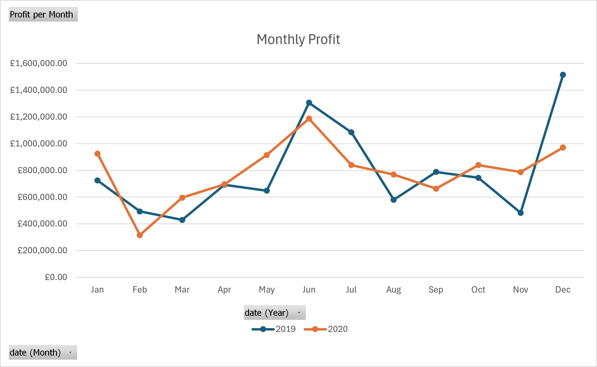
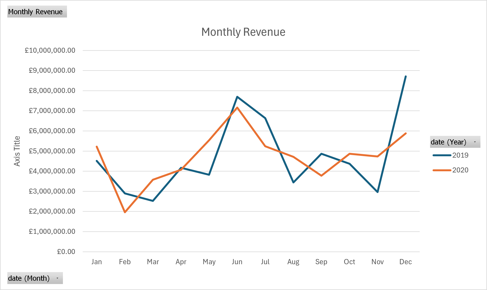
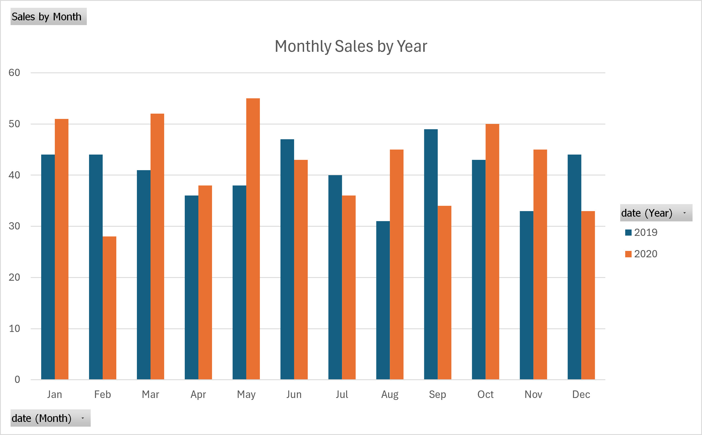
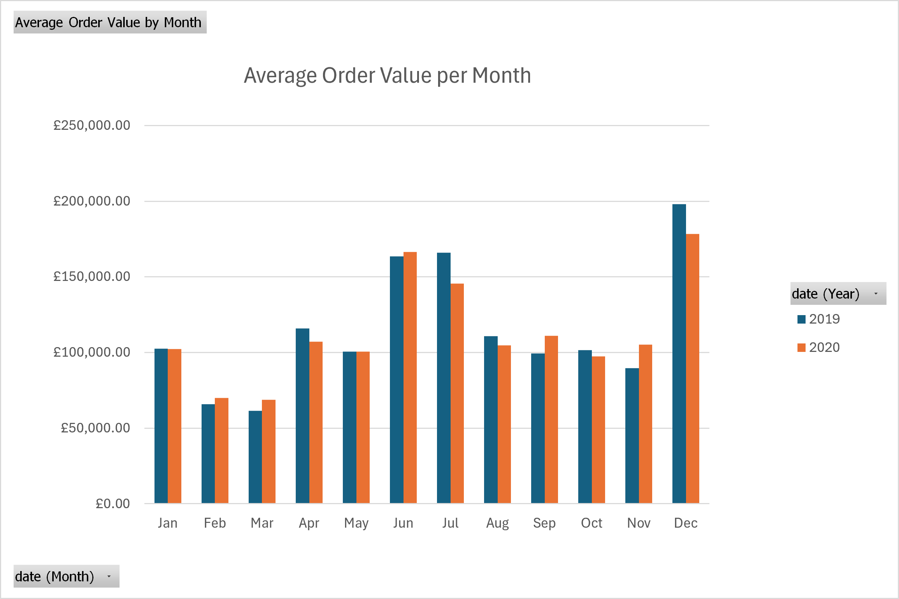
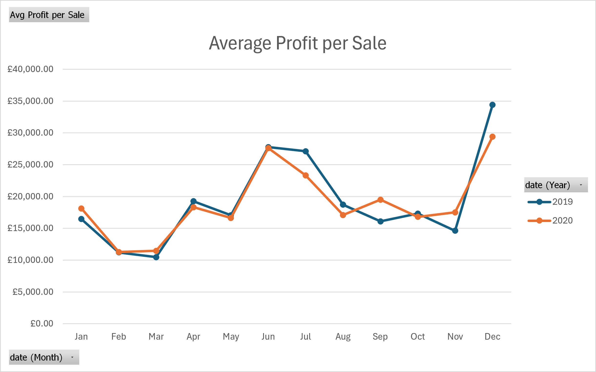

# Sales-Analysis-Project
An analysis in Excel of a sales dataset pulled from Kaggle. The aim of this is to derive key insights that can lead to and influence business decisions through data and visualisations.

# Data Location
The data is publicly available on Kaggle using the following lik: https://www.kaggle.com/datasets/ronnykym/online-store-sales-data

# Project Aims
The overall aim is to find insights that will allow for management to make better decisions and hopefully improve future performance. Doing this requires a direction of course and requires business questions to be answered by this analysis.
The first question/project aim is to **assess whether more sales drives profit**, the second project question/aim is to **determine whether stronger months are driven predominantly by order volume or order size** and the final question/aim is to **examine performance across sales reps and uncover why some over- and under-perform**.

## Do more sales mean larger profits?
What this question is really asking is that per unit, does profit increase when the number of sales increases? We can see clearly that overall profit rises as overall revenue rises from the charts below.

  
  

Unsurprisingly, it is very clear that as total revenue rises for each month so does total profits. Now, if we look at the total sales for each month for 2019 and 2020 we can see if the number of sales effects tota profits.

  

So assessing this by itself, we can see that total monthly sales do not vary greatly. Looking at monthly totals across both years the range of total sales is 23, the average is 83 and the standard deviation is 8 sales so not much spread overall. For 2019 the range is 18, average is 41 and the standard deviation is 5 sales then for 2020 the range is 24, average is 42 and standard deviation is 8 sales also so monthly differences are larger in 2020 but across all of the data it is quite 'compact'. Looking at the chart now as well these statistics are clearly reflected: bars in each year look quite similar in size and there are no real outliers. When we overlay this with the monthly profit chart and the monthly revenue chart we can see that there is a clear difference in shape. Revenue and profits clearly spike in June and December but looking at sales in these months they can be interpreted as 'normal' months. There is more of a relationship with lows in the monthly profit chart and sales as months with the lowest number of sales but still not a clear, strong relationship. The correlation value between monthly sales and monthly profit overall is quite weak at 0.14 but for the individual years the correlation is somewhat strong at 0.45 for 2019 and 0.37 for 2020. This of course assumes a linear relationship so this is not entirely representative of the relationship but it gives a potential insight. So the idea that total sales drives profits is slightly weakened here.

What I think to look at next that could provide key insights is the average profit per order as well as the average order size so we completely isolate the number of sales and see if there is any relationship on a per-sale basis between profit and order value. We have already established total profit and revenue are heavily linked but this was expected.

  
  

